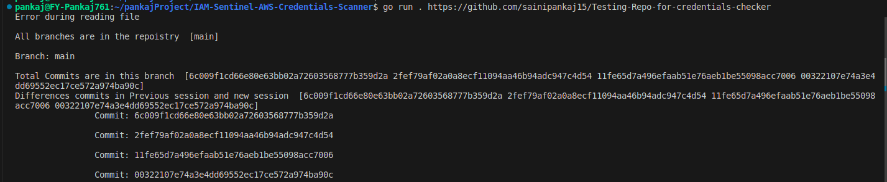
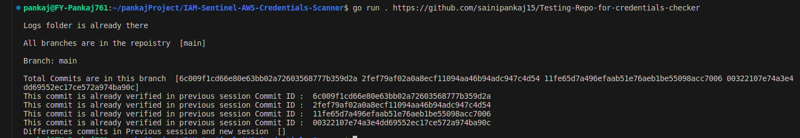

# IAM Sentinel: AWS Credentials Scanner

- This GoLang project's main motive is to find valid IAM Credentials that the developer left in the codebase(obviously by mistake).
- This project scans a Git repository and looks for valid AWS IAM keys. It checks the validity of the Access Key ID by invoking a basic API call supported by AWS. This application helps identify security risks where AWS IAM keys may have been hard coded in application code, which could be visible to multiple organizational members and lead to misuse.

## Prerequisites

To run this project in your local, you must have to Golang installed on your system.

## Usage

- Let say you want to check for this repoistry https://github.com/sainipankaj15/Testing-Repo-for-credentials-checker
- First run :
        
        go mod tidy

- then :  

        go run . <repo_url>

- For above example:

        go run . https://github.com/sainipankaj15/Testing-Repo-for-credentials-checker

The project will attempt to validate the provided Access Key ID by making a basic API call to AWS.

## Result

The result is stored in a `logs/` directory under the name `<repo_name>-result.txt`

## Things that makes better this project

1. Faster Execution

- Concurrency is implemented in `scanDir()` to concurrently process files in a directory.

2. Baseline definition

- This project offers the capability to define a baseline file to ignore items
during the next scan that are present in the baseline. The user will be able to generate the baseline file with the help of this script.
- This feature is helpful if the user is running the script every week and doesn’t want to see the same findings again and again.

- For example :
  - First time you scan one repository 

PS: There is no need to be confused because of "Error during reading file" in the screenshot. It is because the first time we ran this project for any repo, we didn't have the baseline file where we track all the scanned commit details.

  - Second time you scan same repository 

    - Here, we can see that when we run our project for the same repository, we have already scanned commits information, so we skipped them.